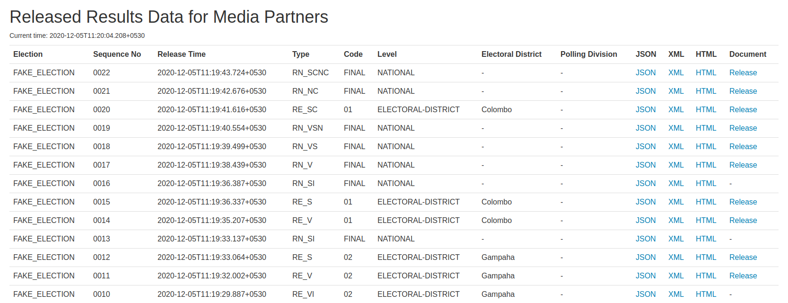

# Results Distribution System

This system distributes results to registered entities.

## High Level Architecture


## Components
This result distributor system consists of three components.
- Distributor (publisher)
- Recipient (subscriber)
- Test driver

All three components can be built and run locally, allowing the entire system to be tested locally while simulating an election.

### Distributor (Publisher)
The distributor consists of the following:
- A WebSocket server at which recipients can establish connections.
- An HTTP service which on receipt of a new result (e.g., a verified result from an upstream system), delivers the same to all registered recipients. For certain types of results, the distributor may also compute and send an incremental result.
- A simple website which allows downloading the released results.

### Recipient (Subscriber)
The recipient is a WebSocket client service that establishes a persistent, one-directional connection with the distributor to receive results. The recipient will continue to receive data as long as the connection is not closed.

### Test Driver
The test driver consists of an HTTP service that allows the following:
- Sending election data to a distributor at specific intervals, simulating publishing result data.
- A simple website to start sending results.

## Different Election Modes
The implementation currently supports the following election modes.

- Presidential Election
- Parliamentary Election

## Building from Source
The implementation currently uses [Ballerina 1.2.4](https://ballerina.io/downloads).

Each component can be built independently. Building each component (module) will result in an executable (JAR file).

### Distributor

Navigate to the [`distributor` project](/distributor/) and build the `distributor` module.

```cmd
$ ballerina build distributor
```

### Subscriber

Navigate to the [`subscriber` project](/subscriber/) and build the `subscriber` module.

```cmd
$ ballerina build subscriber
```

### Test Driver

Navigate to the [`testdriver` project](/testdriver/) and build the `testdriver` module.

```cmd
$ ballerina build testdriver
```

## How to Run

### Distributor

Add a `ballerina.conf` file with the following configuration:
- the database configuration to store results and subscriptions
- the publisher and subscriber details with the relevant scopes set

```toml
[eclk.distributor.db]
 url="jdbc:mysql://localhost:3306/subscriptions"
 username="username"
 password="xxxx"

[b7a.users]

[b7a.users.username1]
password="xxxx"
scopes="publish"

[b7a.users.username2]
password="xxxx"
scopes="subscribe"
```

This file needs to be introduced in the location from which the `distributor.jar` will be run.

Details on how encrypted configuration values can be used is explained [here](https://ballerina.io/learn/by-example/config-api.html).

Now run `distributor.jar`, either using `ballerina run` or `java -jar`.

```cmd
$ ballerina run distributor.jar 
[ballerina/http] started HTTP/WS listener 0.0.0.0:8181
[ballerina/http] started HTTP/WS listener 0.0.0.0:9090

```

Results received by the distributor can also be accessed via the website (http://localhost:9090).



### Subscriber

The subscriber accepts several options specifying username, password, what format(s) the data is required in, the home URL to establish the connection at, etc. 

```
        -username=name          my username for authentication
        -password=password      my password for authentication
        -await=true|false       do I want an "Await Results" notification (default: false)
        -json=true|false        do I want JSON output (default: false)
        -xml=true|false         do I want XML output (default: false)
        -html=true|false        do I want HTML output (default: false)
        -image=true|false       do I want release proof image (default: false)
        -wantCode=true|false    do I want the electionCode in the filename (default: false)
        -homeURL=URL            subscription URL 
```

Run `subscriber.jar`, either using `ballerina run` or `java -jar`, specifying the relevant options.

```cmd
$ ballerina run subscriber.jar -username=my_username -password=my_password -json=true -image=true -homeURL=http://localhost:9090

2020-12-05 11:06:58,806 INFO  [eclk/subscriber] - Established a connection to receive result data and PDF. Connection ID: xxxx-yyyy 
```

A log will be printed with the connection ID if the connection is established successfully. The distributor will also log a similar message for each successful connection. 

### Test Driver

Start the test driver service by running `testdriver.jar`, either using `ballerina run` or `java -jar`, using the `url` option to point to the distributor's results receiving endpoint. The `delay` option can be used to specify the delay between two consecutive results. 

```cmd
$ ballerina run testdriver.jar -url=http://localhost:8181 -delay=1000
[ballerina/http] started HTTP/WS listener 0.0.0.0:9999

```

Trigger publishing results for a particular election simulation by sending a request to the test driver service, specifying the election code.

e.g.,

```cmd
$ curl http://localhost:9999/start/FAKE
Test data publishing starting.
```

Alternatively, a test run can be started via the website (http://localhost:9999).


The distributor should now receive the results and deliver them to the subscribers. 

**Note:** these endpoints will be exposed via HTTPS in a production deployment. Alternatively, you can also [enforce HTTPS at the Ballerina listener level](https://ballerina.io/learn/by-example/https-listener.html) by introducing the relevant configurations.

## How to Contribute

If you wish to request a new feature/improvement or raise an issue you can do so by creating a [GitHub issue](https://github.com/ECLK/Results-Dist/issues).

If you wish to contribute to an open issue, feel free to start a discussion on the relevant issue.

We look forward to your contribution.
